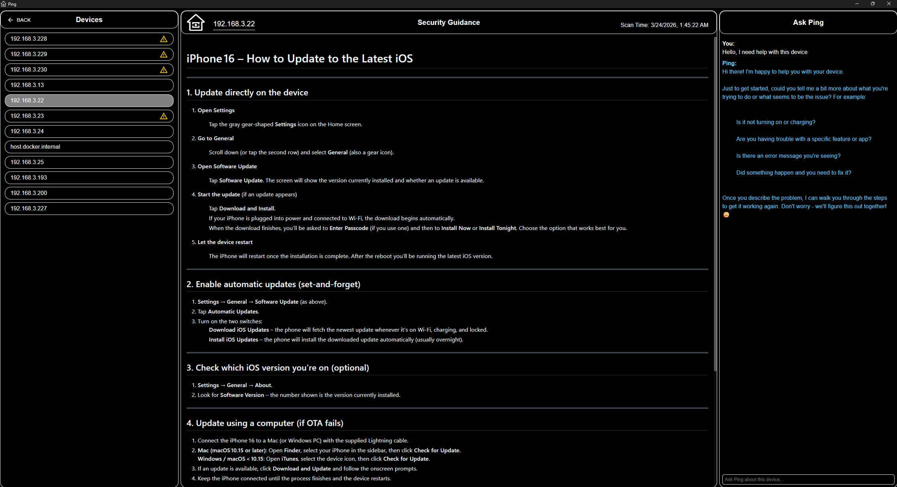
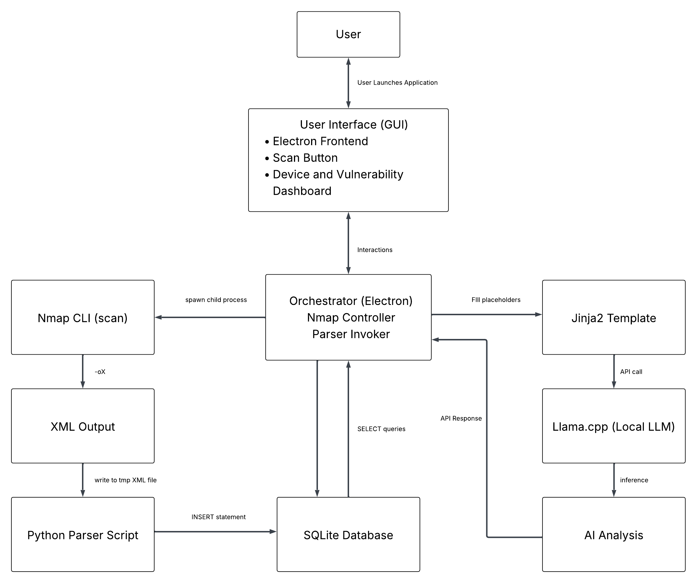

# Ping
### *Make Home Networks Safer*


<br />
<br />

[](LICENSE)

Ping is a desktop application that scans your home network with Nmap, automatically identifies your devices using a local AI model, and delivers plain-language security guidance. No cloud required, no data ever leaves your machine.

Designed for non-technical users, Ping aims to protect households from being easy targets of automated attacks, much like Ring revolutionized physical home security.

---

## UI Overview



---

## Features

- **Network scanning** - scan your entire subnet or just the current device using Nmap with custom NSE scripts for accurate device-type and CPE detection
- **Local AI device identification** - a bundled GGUF model (`ping_device_id`) infers the make and model of each discovered device from scan data; follow-up clarification chat handles ambiguous cases
- **Per-device security guidance** - once a device is identified, Ping pulls human-readable documentation from a local SQLite knowledge base and presents it in the report
- **"Ask Ping" chat assistant** - a second local model (`ping_technical_support`) answers follow-up security questions about any identified device
- **Fully offline after setup** - all AI inference runs on-device via `llama-server`; an internet connection is only needed for the one-time model download
- **Scan history** - all scans are stored in a local SQLite database (`networkscans.db`) and can be reviewed at any time

---

## Architecture



Ping is an Electron application composed of three layers:

| Layer | Technology | Role |
|---|---|---|
| Renderer | React 19, React Router 7, MUI 7 | Pages, components, user interaction |
| Main process | Electron 38, TypeScript | IPC orchestration, process management, SQLite |
| Background processes | Nmap, `orchestrator.exe`, `llama-server` | Scanning, data processing, LLM inference |

**Data flow for a new scan:**

1. The renderer sends an IPC call (`nmap:startScan`) to the main process.
2. The main process spawns **Nmap** with custom NSE scripts; results are written to a temp XML file.
3. The main process spawns **`orchestrator.exe`**, which parses the XML and populates `networkscans.db` (SQLite in the user's app data directory).
4. The main process calls **`llama-server`** (port 3500) with each device's scan data to run the device-identification model.
5. The renderer reads the populated database via IPC and displays the three-pane report: device list, security guidance (Markdown from the knowledge base), and the Ask Ping chat.

---

## Prerequisites

| Requirement | Notes |
|---|---|
| **Windows 10/11** | Primary supported platform. `llama-server` binaries, `orchestrator.exe`, and GPU detection (`wmic`) are Windows-specific in the current build. |
| **Node.js 20+** and **npm 10+** | Required to build from source. |
| **Nmap** | Must be installed. Windows default path: `C:\Program Files (x86)\Nmap\nmap.exe`. Elsewhere: must be on `PATH`. |
| **~6 GB free disk space** | For the two GGUF models downloaded on first run. |
| **NVIDIA or AMD GPU** (recommended) | Used for faster LLM inference. CPU fallback is available but significantly slower. |

---

## Getting Started

### Install from a prebuilt Zip

You can find the prebuilt release of Ping as a zip file [here](https://drive.google.com/file/d/13fIwyz5RNlWMdPXfsEWiVoGk0q6bOF8m/view?usp=sharing). Note: this is a Google Drive link and running the installer will ask you to bypass antivirus as the release is unsigned currently.

#### IMPORTANT
Verify the sha256 hash from Google Drive matches the hash below. DO NOT run if the hash does not match.
`E120A8D645F9463BE6F1718E05443F122268850D6F8DF49A6523DC2AA52B14F3`

### Build from source

> All commands below run from the `Ping/` subdirectory.

```bash
# 1. Clone the repository
git clone <repo-url>
cd ping/Ping

# 2. Install dependencies
npm install

# 3. Place required bundled resources (see section below)

# 4. Start in development mode (Electron + Vite HMR)
npm run dev
```

#### Build a distributable installer

```bash
npm run build:win    # Windows NSIS installer
npm run build:mac    # macOS dmg
npm run build:linux  # Linux AppImage / deb / snap
```

---

## Bundled Resources (required for builds)

The following files are not tracked in git and must be obtained separately before building or running the application (to be released in seperate repositories):

| Path | Purpose |
|---|---|
| `Ping/resources/python/orchestrator.exe` | Post-processes Nmap XML into the SQLite scan database |
| `Ping/resources/llama-cpp-gpu/` | `llama-server` binary compiled with GPU support |
| `Ping/resources/llama-cpp-cpu/` | `llama-server` binary for CPU-only inference |
| `Ping/resources/knowledgeBase/knowledge_base.db` | SQLite database of per-device security documentation |
| `Ping/resources/python/scripts/` | Custom Nmap NSE scripts and CVE reference CSVs |

The AI models (`ping_device_id.gguf`, `ping_technical_support.gguf`) are downloaded automatically from Hugging Face on first run and stored in the user's app data directory.

---

## Project Structure

```
ping/
├── assets/                         ← Repository images (README, docs)
├── LICENSE                         ← Apache 2.0
├── README.md
└── Ping/                           ← Electron application root
    ├── src/
    │   ├── main/                   ← Electron main process
    │   │   ├── index.ts            ← IPC handlers, process spawning, SQLite, LLM
    │   │   └── ipcStatus.ts        ← Push-event helpers (scan/model progress)
    │   ├── preload/                ← Preload bridge (window.electronAPI)
    │   │   └── index.ts
    │   └── renderer/               ← React UI
    │       └── src/
    │           ├── App.tsx         ← Router, model-status gate
    │           ├── pages/          ← HomePage, ModelDownloadPage, ScanOptionsPage,
    │           │                      ScanSelectionPage, ReportPage
    │           ├── components/     ← DeviceMenu, BackButton, MarkdownRenderer, …
    │           └── theme/          ← MUI theme
    ├── resources/                  ← Bundled runtime assets (see above)
    ├── build/                      ← Installer assets (NSIS script, icons, license)
    ├── electron.vite.config.ts
    ├── electron-builder.yml
    ├── tsconfig.json
    └── package.json
```

---

## Tech Stack

| Category | Libraries / Tools |
|---|---|
| Desktop shell | Electron 38, electron-vite 4, Vite 7 |
| UI | React 19, React Router 7, MUI 7, Emotion |
| Data | better-sqlite3 |
| AI / LLM | llama-server (llama.cpp), @huggingface/hub, @huggingface/jinja |
| Markdown | react-markdown, remark-gfm, github-markdown-css |
| Language | TypeScript 5.9 |
| Tooling | ESLint 9, Prettier 3 |

---

## License

Copyright 2026 Josiah Bronkema, Alex Dzurec, Jared Volle

Licensed under the [Apache License, Version 2.0](LICENSE).
